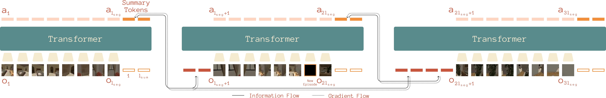

<div align="center">
<h1>Memo: Training Memory-Efficient Embodied Agents with Reinforcement Learning</h1>
<p>
  <a href="https://gunshigupta.netlify.app/">Gunshi Gupta</a>,
  <a href="https://www.karmeshyadav.com/">Karmesh Yadav</a>,
  <a href="https://faculty.cc.gatech.edu/~zk15/">Zsolt Kira</a>,
  <a href="https://www.cs.ox.ac.uk/people/yarin.gal/website/">Yarin Gal</a>,
  <a href="https://www.linkedin.com/in/rahaf-aljundi/">Rahaf Aljundi</a>
  
</p>
<p>
  <a href="https://arxiv.org/pdf/2510.19732">Paper Link</a>
</p>
</div>

This is the official implementation for the paper, Memo: Training Memory-Efficient Embodied Agents with Reinforcement Learning. Abstract below:

To enable embodied agents to operate effectively over extended timeframes, it is crucial to develop models that form and access memories to stay contextualized in their environment. In the current paradigm of training transformer-based policies for embodied sequential decision-making tasks, visual inputs often overwhelm the context limits of transformers, while humans can maintain and utilize a lifetime of experience compressed as memories. Significant compression is possible in principle, as much of the input is irrelevant and can be abstracted. However, existing approaches predominantly focus on either recurrent models with fixed-size memory or transformers with full-context reliance. In this work, we propose Memo, a transformer-based architecture and training recipe for reinforcement learning (RL) on memory-intensive, long-horizon tasks. Memo incorporates the creation and retrieval of memory by interleaving periodic summarization tokens with the
inputs of a model during training. We demonstrate Memo’s effectiveness on a gridworld meta-RL benchmark and a multi-object navigation task in photo-realistic indoor settings. Memo outperforms naive long-context transformer baselines while being more compute and storage efficient. Additionally, Memo generalizes better to longer contexts at inference time and remains robust in streaming settings, where historical context must be truncated to fit inference constraints.

<div align="center">

</div>

## Installation
* Clone the repo.
    ```bash
    git clone https://github.com/gunshi/memo.git
    cd memo
    ```
* Install memo
    ```bash
    conda create -n memo -y python=3.9
    conda activate memo
    conda install -y habitat-sim==0.3.0 withbullet headless -c conda-forge -c aihabitat

    pip install packaging ninja
    pip install -e .
    ```
* In another directory:
    ```bash
    git clone git@github.com:facebookresearch/eai-vc.git
    cd eai-vc
    pip install -e ./vc_models
    ```
* Change the dir to `memo` and then download ExtObjNav data (ExtObjNav dataset, scenes dataset and VC1 finetuned checkpoint). Make sure git lfs is installed first.
    ```bash
    bash download_datasets.sh
    ```


## Running
```bash
bash memo/scripts/run_hssd.sh (FCT baseline)
bash memo/scripts/run_hssd_ac.sh (Memo - method that makes summaries with accumulation)
bash memo/scripts/run_hssd_rmt.sh (Recurrent version of Memo - makes summary but no acccumulation, so memory is effectively overwritten)
```

The commands to launch in evaluation mode are in commented out lines.

This work wouldn't have been possible without [ReLIC](https://arxiv.org/pdf/2510.19732).

Citation:
If you find this work useful, please cite:
```bibtex
@article{gupta2025memo,
  title={Memo: Training Memory-Efficient Embodied Agents with Reinforcement Learning},
  author={Gupta, Gunshi and Yadav, Karmesh and Kira, Zsolt and Gal, Yarin and Aljundi, Rahaf},
  journal={arXiv preprint arXiv:2510.19732},
  year={2025}
}
```